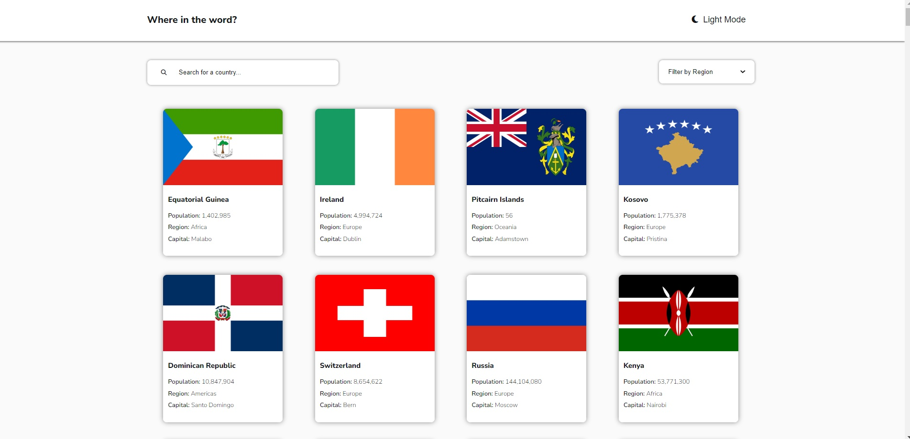
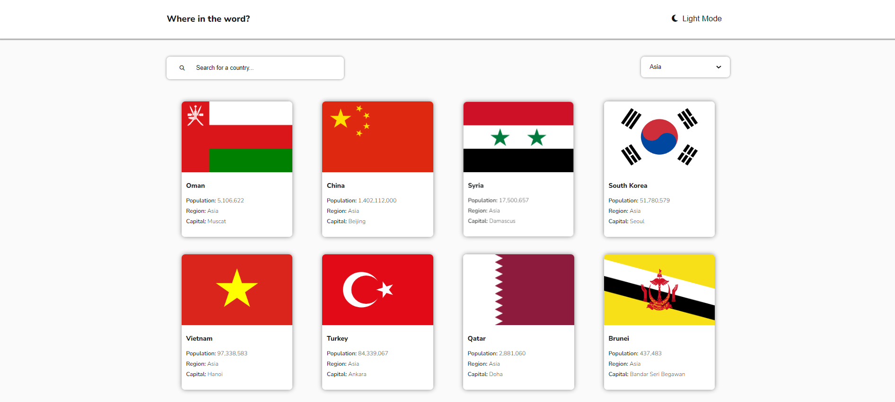
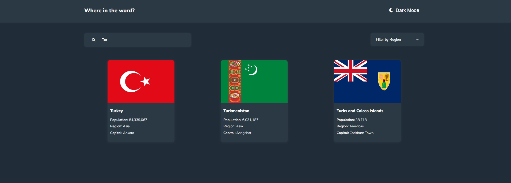
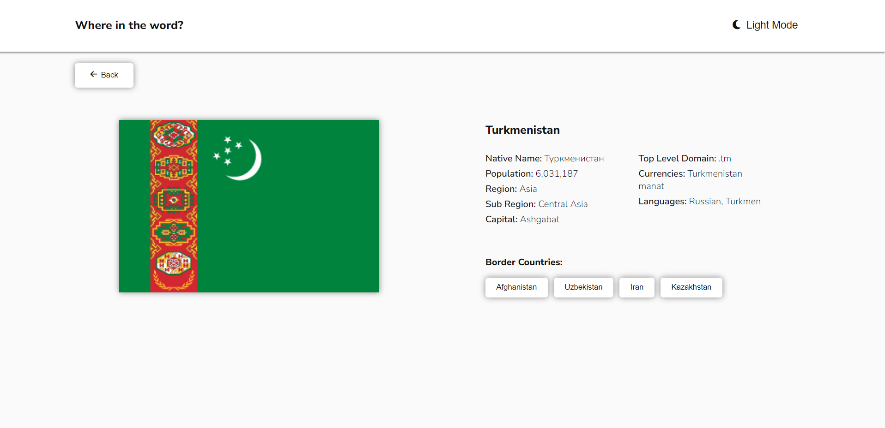
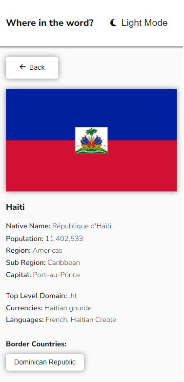

# Rest-countries

### Used REST Countries API - [Here](https://restcountries.com/)

### Challenge from - [Frontend Mentor](https://www.frontendmentor.io/challenges/rest-countries-api-with-color-theme-switcher-5cacc469fec04111f7b848ca)

### Live demo - [Click](https://lk-rest-countries.netlify.app/)

### Users can: 
- filter country by region 
- search country using an input
- toggle the color scheme beetwen ligth/dark mode
- see the loading-spinner while waiting for API response or alternatively some errors 
- learn something about geography 🙂

### Screenshots

